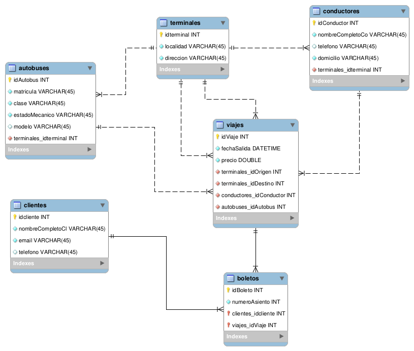

# Trips con Spring Boot

Se desarrolla un Backend para venta de boletos de autobus utilizando Spring Boot.

### Especificaciones
Se tienen terminales en diferentes estados de la República, las cuales son origen y destino de los viajes. Cada terminal tiene adscritos un conjunto de autobuses y uno de conductores, los cuales son asignados a cada viaje según su disponibilidad y de manera independiente unos de otros. Los viajes son programados con origen, destino, fecha y hora de salida. El precio del boleto se establece al programar el viaje (dependiendo de diferentes factores). Todos los autobuses tienen cuarenta asientos y se clasifican en las clases primera, segunda y tercera; otras características importantes que se deben tomar en cuenta son la matrícula del autobús y su estado mecánico (operativo o en mantenimiento). Los clientes deben registrarse con: nombre completo, domicilio, correo electrónico y telefono. Cuando el cliente compra un vije selecciona un asiento. Para cada viaje de ida, hay uno de regreso en el mismo autobús y el mismo conductor.

### Desarrollo

1. Se crea un proyecto Spring Boot con las dependencias Spring Web, Spring JPA y MySQL Driver.
2. Se configura el acceso a la base de datos (previamente creada) en application.properties.
3. Se crean las entidades en com.trips.tripsspringboot.entity y se verifica que se se crean las tablas en la base de datos (previamente creada).
4. Se crean las interfaces que "extends" de JpaRepository para poder hacer las consultas. Se crean en com.trips.tripsspringboot.repository.
5. Se crea un seeder en com.trips.tripsspringboot.config para insertar datos en las tablas, con ayuda de las interfaces en repository.
6. Se crean controladores en com.trips.tripsspringboot.controller para los "end points" del api. Los controladores se comunican con los servicios (interfaces y sus implementaciones) y estos con los repositorios (interfaces).
7. 

